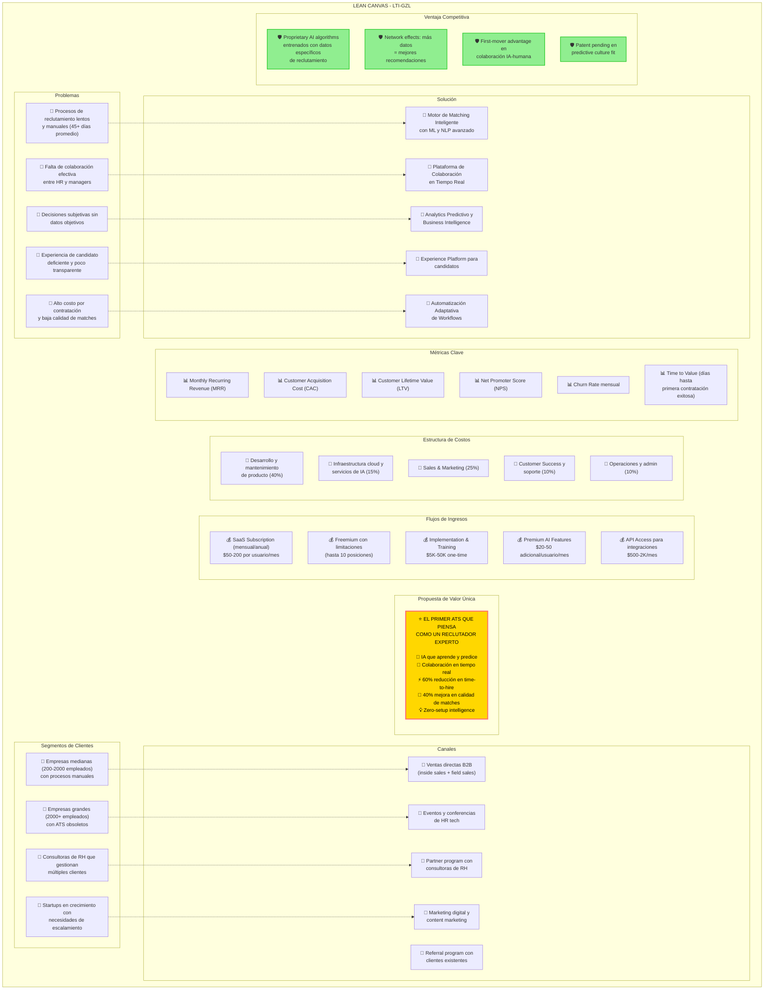

# Tarea 3: Lean Canvas para LTI-GZL

## Lean Canvas LTI-GZL - Sistema ATS Inteligente

Modelo de negocio completo que muestra problemas identificados, segmentos de clientes, propuesta de valor, solución, canales, flujos de ingresos, estructura de costos, métricas clave y ventajas competitivas.

## Elementos Clave del Canvas

### Problemas Principales
- Procesos de reclutamiento lentos y manuales
- Falta de colaboración entre HR y managers  
- Decisiones subjetivas sin datos objetivos
- Experiencia de candidato deficiente
- Alto costo y baja calidad de matches

### Propuesta de Valor Única
**"El Primer ATS que Piensa como un Reclutador Experto"**
- IA que aprende y predice
- Colaboración en tiempo real
- 60% reducción en time-to-hire
- 40% mejora en calidad de matches
- Zero-setup intelligence
