# Tarea 3: Lean Canvas para LTI-GZL

## Lean Canvas LTI-GZL - Sistema ATS Inteligente

Modelo de negocio completo que muestra problemas identificados, segmentos de clientes, propuesta de valor, solución, canales, flujos de ingresos, estructura de costos, métricas clave y ventajas competitivas.

```mermaid
graph TB
    subgraph "LEAN CANVAS - LTI-GZL"
        subgraph "Problemas"
            P1["🔴 Procesos de reclutamiento lentos<br/>y manuales (45+ días promedio)"]
            P2["🔴 Falta de colaboración efectiva<br/>entre HR y managers"]
            P3["🔴 Decisiones subjetivas sin<br/>datos objetivos"]
            P4["🔴 Experiencia de candidato<br/>deficiente y poco transparente"]
            P5["🔴 Alto costo por contratación<br/>y baja calidad de matches"]
        end
        
        subgraph "Segmentos de Clientes"
            SC1["🎯 Empresas medianas (200-2000 empleados)<br/>con procesos manuales"]
            SC2["🎯 Empresas grandes (2000+ empleados)<br/>con ATS obsoletos"]
            SC3["🎯 Consultoras de RH que gestionan<br/>múltiples clientes"]
            SC4["🎯 Startups en crecimiento con<br/>necesidades de escalamiento"]
        end
        
        subgraph "Propuesta de Valor Única"
            PVU["⭐ EL PRIMER ATS QUE PIENSA<br/>COMO UN RECLUTADOR EXPERTO<br/><br/>🤖 IA que aprende y predice<br/>🤝 Colaboración en tiempo real<br/>⚡ 60% reducción en time-to-hire<br/>🎯 40% mejora en calidad de matches<br/>💡 Zero-setup intelligence"]
        end
        
        subgraph "Solución"
            S1["🔧 Motor de Matching Inteligente<br/>con ML y NLP avanzado"]
            S2["🔧 Plataforma de Colaboración<br/>en Tiempo Real"]
            S3["🔧 Automatización Adaptativa<br/>de Workflows"]
            S4["🔧 Analytics Predictivo y<br/>Business Intelligence"]
            S5["🔧 Experience Platform para<br/>candidatos"]
        end
        
        subgraph "Canales"
            C1["📱 Ventas directas B2B<br/>(inside sales + field sales)"]
            C2["📱 Partner program con<br/>consultoras de RH"]
            C3["📱 Marketing digital y<br/>content marketing"]
            C4["📱 Eventos y conferencias<br/>de HR tech"]
            C5["📱 Referral program con<br/>clientes existentes"]
        end
        
        subgraph "Flujos de Ingresos"
            FI1["💰 SaaS Subscription (mensual/anual)<br/>$50-200 por usuario/mes"]
            FI2["💰 Freemium con limitaciones<br/>(hasta 10 posiciones)"]
            FI3["💰 Implementation & Training<br/>$5K-50K one-time"]
            FI4["💰 Premium AI Features<br/>$20-50 adicional/usuario/mes"]
            FI5["💰 API Access para integraciones<br/>$500-2K/mes"]
        end
        
        subgraph "Estructura de Costos"
            EC1["💸 Desarrollo y mantenimiento<br/>de producto (40%)"]
            EC2["💸 Infraestructura cloud y<br/>servicios de IA (15%)"]
            EC3["💸 Sales & Marketing (25%)"]
            EC4["💸 Customer Success y<br/>soporte (10%)"]
            EC5["💸 Operaciones y admin (10%)"]
        end
        
        subgraph "Métricas Clave"
            MK1["📊 Monthly Recurring Revenue (MRR)"]
            MK2["📊 Customer Acquisition Cost (CAC)"]
            MK3["📊 Customer Lifetime Value (LTV)"]
            MK4["📊 Net Promoter Score (NPS)"]
            MK5["📊 Churn Rate mensual"]
            MK6["📊 Time to Value (días hasta<br/>primera contratación exitosa)"]
        end
        
        subgraph "Ventaja Competitiva"
            VC1["🛡️ Proprietary AI algorithms<br/>entrenados con datos específicos<br/>de reclutamiento"]
            VC2["🛡️ Network effects: más datos<br/>= mejores recomendaciones"]
            VC3["🛡️ First-mover advantage en<br/>colaboración IA-humana"]
            VC4["🛡️ Patent pending en<br/>predictive culture fit"]
        end
    end

    %% Relaciones visuales
    P1 -.-> S1
    P2 -.-> S2
    P3 -.-> S4
    P4 -.-> S5
    P5 -.-> S3
    
    SC1 -.-> C1
    SC2 -.-> C4
    SC3 -.-> C2
    SC4 -.-> C3
    
    style PVU fill:#FFD700,stroke:#FF6B6B,stroke-width:3px,color:#000
    style VC1 fill:#90EE90,stroke:#32CD32,stroke-width:2px
    style VC2 fill:#90EE90,stroke:#32CD32,stroke-width:2px
    style VC3 fill:#90EE90,stroke:#32CD32,stroke-width:2px
    style VC4 fill:#90EE90,stroke:#32CD32,stroke-width:2px
```

## Elementos Clave del Canvas

### Problemas Principales
- Procesos de reclutamiento lentos y manuales
- Falta de colaboración entre HR y managers  
- Decisiones subjetivas sin datos objetivos
- Experiencia de candidato deficiente
- Alto costo y baja calidad de matches

### Propuesta de Valor Única
**"El Primer ATS que Piensa como un Reclutador Experto"**
- IA que aprende y predice
- Colaboración en tiempo real
- 60% reducción en time-to-hire
- 40% mejora en calidad de matches
- Zero-setup intelligence
