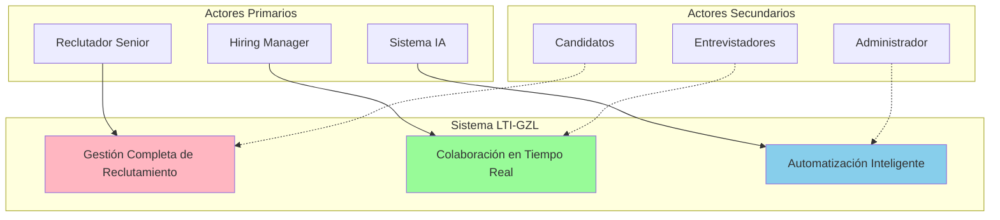
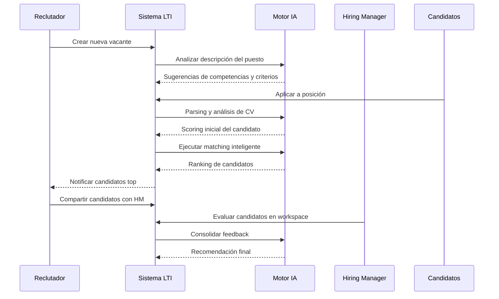
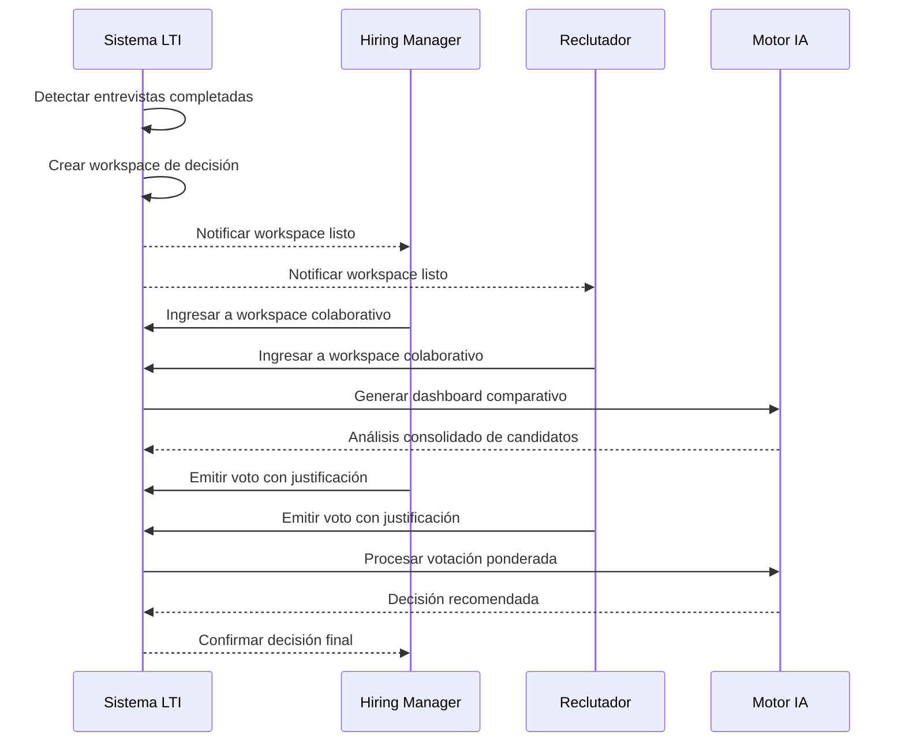

# Tarea 4: Casos de Uso Principales del Sistema LTI-GZL

## Diagramas UML - Casos de Uso

### Diagrama de Casos de Uso General

### Diagrama de Secuencia - Proceso de Reclutamiento

### Diagrama de Secuencia - Colaboración en Tiempo Real

