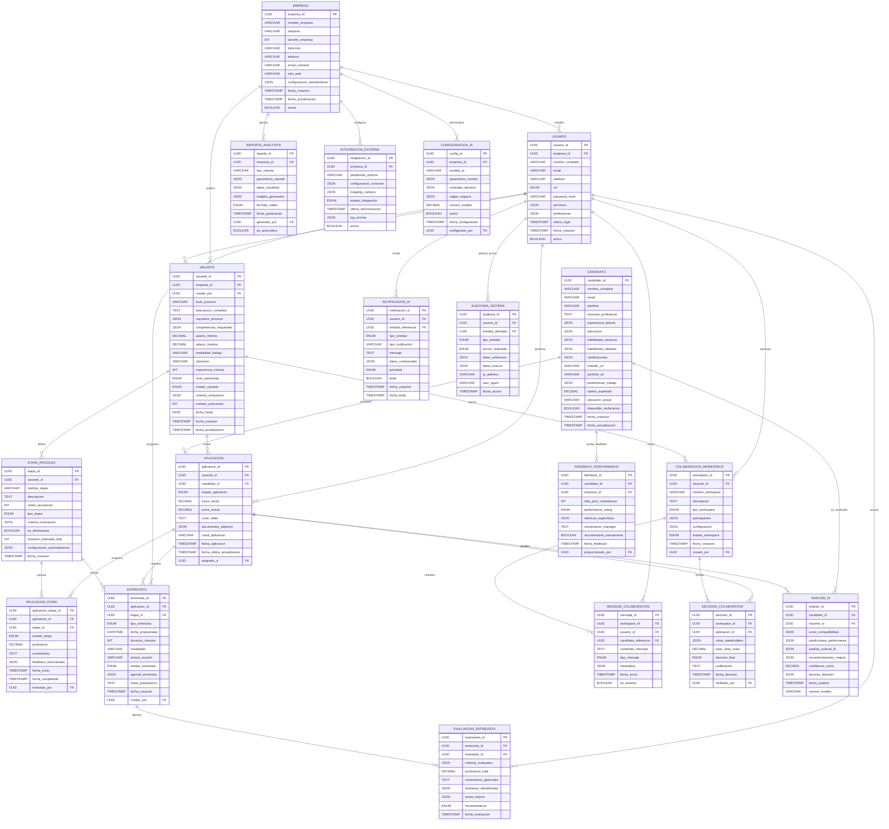

# Tarea 5: Modelado de Datos del Sistema LTI-GZL

## Diagrama Entidad-Relación

Modelo de datos completo para el sistema LTI-GZL que incluye las entidades principales para gestión de candidatos, vacantes, colaboración, IA y analytics.

## Entidades Principales
- **EMPRESA**: Organizaciones cliente del sistema
- **USUARIO**: Reclutadores, hiring managers, entrevistadores
- **VACANTE**: Posiciones abiertas para reclutamiento
- **CANDIDATO**: Perfiles de personas que buscan empleo
- **APLICACION**: Candidaturas a posiciones específicas
- **ENTREVISTA**: Sesiones de evaluación
- **COLABORACION_WORKSPACE**: Espacios de trabajo colaborativo
- **ANALISIS_IA**: Resultados de análisis de inteligencia artificial
- **REPORTE_ANALYTICS**: Dashboards y reportes del sistema
