# Tarea 6: Diseño de Arquitectura de Alto Nivel - Sistema LTI-GZL

## Arquitectura de Microservicios

Patrón arquitectónico de microservicios modulares híbridos que permite escalabilidad independiente, desarrollo paralelo y tecnologías diversas para IA/ML y colaboración en tiempo real.

### Diagrama de Arquitectura de Alto Nivel

```mermaid
graph TB
    subgraph "Frontend Layer"
        WEB[Web Application<br/>React + TypeScript]
        MOBILE[Mobile App<br/>React Native]
        API_GW[API Gateway<br/>Kong/AWS API Gateway]
    end
    
    subgraph "Core Business Services"
        CANDIDATE[Candidate Service<br/>Node.js + Express]
        VACANCY[Vacancy Service<br/>Node.js + Express]
        APPLICATION[Application Service<br/>Node.js + Express]
        INTERVIEW[Interview Service<br/>Node.js + Express]
        COLLABORATION[Collaboration Service<br/>Node.js + Socket.io]
    end
    
    subgraph "AI/ML Services"
        ML_MATCHING[ML Matching Engine<br/>Python + FastAPI]
        NLP_PROCESSOR[NLP Processor<br/>Python + spaCy/BERT]
        PREDICTION[Prediction Service<br/>Python + TensorFlow]
        AI_ORCHESTRATOR[AI Orchestrator<br/>Python + Celery]
    end
    
    subgraph "Support Services"
        AUTH[Authentication Service<br/>Node.js + JWT]
        NOTIFICATION[Notification Service<br/>Node.js + Bull]
        ANALYTICS[Analytics Service<br/>Python + Pandas]
        INTEGRATION[Integration Hub<br/>Node.js + Express]
        FILE_STORAGE[File Storage Service<br/>Node.js + AWS S3]
    end
    
    subgraph "Data Layer"
        POSTGRES[(PostgreSQL<br/>Primary Database)]
        REDIS[(Redis<br/>Cache + Sessions)]
        ELASTICSEARCH[(Elasticsearch<br/>Search + Analytics)]
        ML_STORE[(MLflow<br/>Model Storage)]
        FILE_STORE[(AWS S3<br/>File Storage)]
    end
    
    subgraph "Infrastructure"
        QUEUE[Message Queue<br/>Redis/AWS SQS]
        MONITOR[Monitoring<br/>Prometheus + Grafana]
        LOGGING[Logging<br/>ELK Stack]
        SECRETS[Secrets Manager<br/>AWS Secrets Manager]
    end
    
    subgraph "External Integrations"
        LINKEDIN[LinkedIn API]
        INDEED[Indeed API] 
        EMAIL[Email Provider<br/>SendGrid]
        VIDEO[Video Platform<br/>Zoom/Teams]
        HRMS[HRMS Systems<br/>Workday/SAP]
    end
    
    %% Frontend connections
    WEB --> API_GW
    MOBILE --> API_GW
    API_GW --> CANDIDATE
    API_GW --> VACANCY
    API_GW --> APPLICATION
    API_GW --> INTERVIEW
    API_GW --> COLLABORATION
    API_GW --> AUTH
    
    %% Core service connections
    CANDIDATE --> ML_MATCHING
    VACANCY --> ML_MATCHING
    APPLICATION --> PREDICTION
    APPLICATION --> NLP_PROCESSOR
    COLLABORATION --> NOTIFICATION
    
    %% AI service orchestration
    AI_ORCHESTRATOR --> ML_MATCHING
    AI_ORCHESTRATOR --> NLP_PROCESSOR
    AI_ORCHESTRATOR --> PREDICTION
    
    %% Support service connections
    AUTH --> REDIS
    NOTIFICATION --> QUEUE
    ANALYTICS --> ELASTICSEARCH
    INTEGRATION --> LINKEDIN
    INTEGRATION --> INDEED
    INTEGRATION --> HRMS
    
    %% Data layer connections
    CANDIDATE --> POSTGRES
    VACANCY --> POSTGRES
    APPLICATION --> POSTGRES
    INTERVIEW --> POSTGRES
    COLLABORATION --> REDIS
    ML_MATCHING --> ML_STORE
    ANALYTICS --> ELASTICSEARCH
    FILE_STORAGE --> FILE_STORE
    
    %% Infrastructure connections
    CANDIDATE --> QUEUE
    VACANCY --> QUEUE
    APPLICATION --> QUEUE
    NOTIFICATION --> EMAIL
    INTERVIEW --> VIDEO
    
    style API_GW fill:#FFB6C1
    style ML_MATCHING fill:#98FB98
    style COLLABORATION fill:#87CEEB
    style AI_ORCHESTRATOR fill:#DDA0DD
    style POSTGRES fill:#F0E68C
```

## Componentes Principales

### **Frontend Layer**
- **Web Application**: React + TypeScript para reclutadores y hiring managers
- **Mobile App**: React Native para acceso móvil y notificaciones
- **API Gateway**: Kong/AWS API Gateway como punto de entrada único

### **Core Business Services**
- **Candidate Service**: Gestión completa de perfiles de candidatos
- **Vacancy Service**: Administración de posiciones abiertas
- **Application Service**: Flujo aplicación-candidato-vacante
- **Interview Service**: Gestión de entrevistas y evaluaciones
- **Collaboration Service**: Workspaces en tiempo real con Socket.io

### **AI/ML Services**
- **ML Matching Engine**: Algoritmos de matching candidato-vacante
- **NLP Processor**: Análisis semántico con spaCy/BERT
- **Prediction Service**: Modelos predictivos con TensorFlow
- **AI Orchestrator**: Coordinación de servicios de IA con Celery

### **Support Services**
- **Authentication**: JWT y Single Sign-On
- **Notification**: Sistema multi-canal con Bull Queue
- **Analytics**: Reportes y dashboards con Pandas
- **Integration Hub**: Conectores a sistemas externos
- **File Storage**: Gestión de archivos con AWS S3

### **Data Layer**
- **PostgreSQL**: Base de datos principal
- **Redis**: Cache y sesiones distribuidas
- **Elasticsearch**: Búsqueda y analytics
- **MLflow**: Almacenamiento de modelos ML
