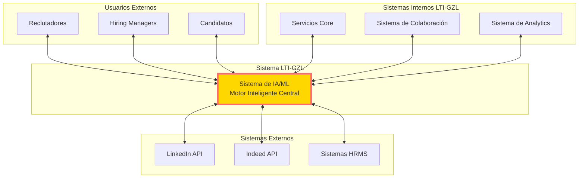
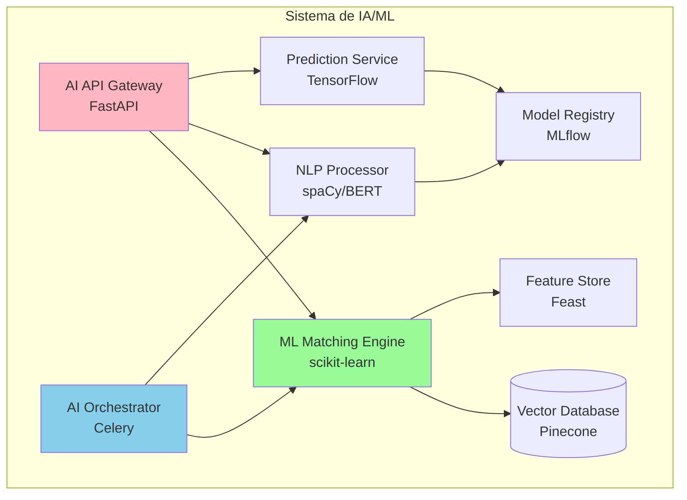
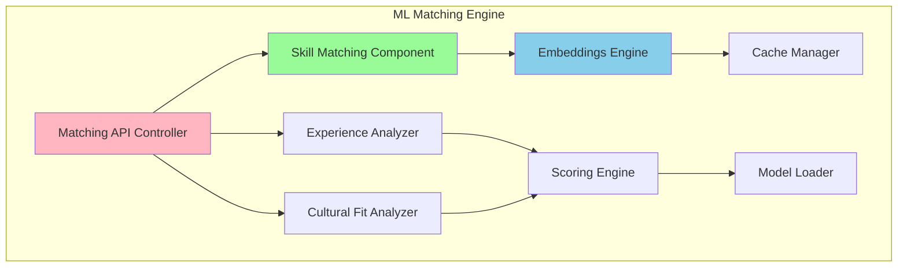
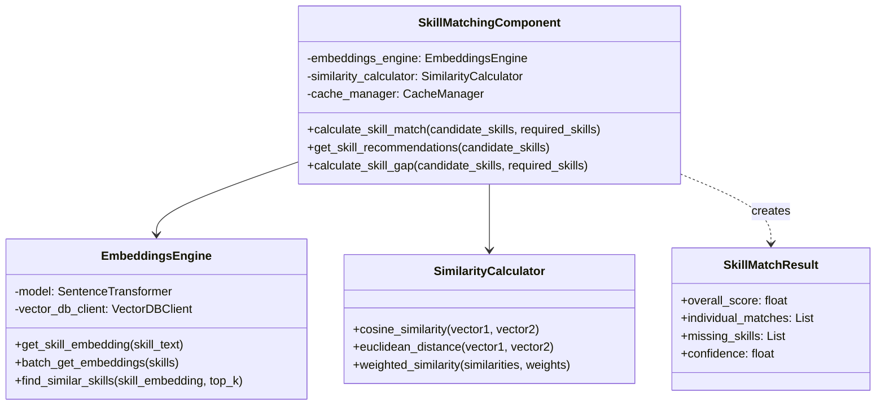

# Tarea 7: Diagrama C4 - Sistema de IA/ML (Componente Crítico)

## Sistema de IA/ML - Análisis C4

El Sistema de IA/ML es el diferenciador clave que proporciona matching inteligente, predicciones de éxito y automatización adaptativa.

---

## **NIVEL 1 - CONTEXTO DEL SISTEMA**

### Diagrama de Contexto

```mermaid
graph TB
    subgraph "Usuarios Externos"
        RECRUITER[Reclutadores]
        MANAGERS[Hiring Managers]
        CANDIDATES[Candidatos]
        ADMINS[Administradores]
    end
    
    subgraph "Sistema LTI-GZL"
        AI_SYSTEM[Sistema de IA/ML<br/>Motor Inteligente Central]
    end
    
    subgraph "Sistemas Externos"
        LINKEDIN[LinkedIn API]
        INDEED[Indeed API]
        EMAIL_SYS[Sistema de Email]
        CALENDAR[Sistemas de Calendario]
        HRMS[Sistemas HRMS<br/>Workday/SAP]
        ASSESSMENT[Plataformas de Assessment<br/>HackerRank/Codility]
    end
    
    subgraph "Sistemas Internos LTI-GZL"
        CORE_SERVICES[Servicios Core<br/>Candidatos/Vacantes/Aplicaciones]
        COLLABORATION[Sistema de Colaboración]
        ANALYTICS[Sistema de Analytics]
        NOTIFICATION[Sistema de Notificaciones]
    end
    
    %% Interacciones con usuarios
    RECRUITER -.->|"Configura criterios de matching<br/>Revisa recomendaciones"| AI_SYSTEM
    AI_SYSTEM -.->|"Candidatos rankeados<br/>Insights predictivos"| RECRUITER
    
    MANAGERS -.->|"Feedback de contrataciones<br/>Ajusta pesos de evaluación"| AI_SYSTEM
    AI_SYSTEM -.->|"Recomendaciones de candidatos<br/>Predicciones de éxito"| MANAGERS
    
    CANDIDATES -.->|"Completa evaluaciones<br/>Proporciona información"| AI_SYSTEM
    AI_SYSTEM -.->|"Recomendaciones de posiciones<br/>Feedback personalizado"| CANDIDATES
    
    ADMINS -.->|"Configura modelos<br/>Monitorea performance"| AI_SYSTEM
    AI_SYSTEM -.->|"Métricas de modelos<br/>Alertas de performance"| ADMINS
    
    %% Interacciones con sistemas externos
    AI_SYSTEM <-->|"Enriquecimiento de perfiles<br/>Benchmarking salarial"| LINKEDIN
    AI_SYSTEM <-->|"Análisis de mercado laboral<br/>Trending skills"| INDEED
    AI_SYSTEM -->|"Comunicaciones personalizadas<br/>Recomendaciones automáticas"| EMAIL_SYS
    AI_SYSTEM <-->|"Optimización de scheduling<br/>Análisis de disponibilidad"| CALENDAR
    AI_SYSTEM <-->|"Sincronización de datos<br/>Predicciones de performance"| HRMS
    AI_SYSTEM <-->|"Resultados de evaluaciones<br/>Scoring técnico"| ASSESSMENT
    
    %% Interacciones con sistemas internos
    CORE_SERVICES <-->|"Datos de candidatos/vacantes<br/>Scoring y rankings"| AI_SYSTEM
    COLLABORATION <-->|"Contexto de decisiones<br/>Sugerencias de colaboración"| AI_SYSTEM
    ANALYTICS <-->|"Datos para reportes<br/>Insights predictivos"| AI_SYSTEM
    NOTIFICATION <-->|"Triggers inteligentes<br/>Contenido personalizado"| AI_SYSTEM
    
    style AI_SYSTEM fill:#FFD700,stroke:#FF6B6B,stroke-width:4px
    style RECRUITER fill:#E6F3FF
    style MANAGERS fill:#E6F3FF
    style LINKEDIN fill:#F0F8FF
    style INDEED fill:#F0F8FF
```

## **NIVEL 1 - CONTEXTO DEL SISTEMA**

## **NIVEL 2 - CONTENEDORES**

## **NIVEL 3 - COMPONENTES (ML Matching Engine)**

## **NIVEL 4 - CÓDIGO (Skill Matching Component)**

## Tecnologías Clave

### **API Layer**
- **FastAPI**: API Gateway con documentación automática
- **Pydantic**: Validación de datos y serialización

### **AI Services**
- **scikit-learn**: Algoritmos de machine learning clásicos
- **spaCy + BERT**: Procesamiento de lenguaje natural
- **TensorFlow**: Modelos de deep learning y predicción

### **Orquestación**
- **Celery**: Task queues para procesamiento asíncrono
- **MLflow**: Gestión de modelos y experimentos
- **Feast**: Feature store para ML

### **Almacenamiento**
- **Pinecone/Weaviate**: Base de datos vectorial
- **Redis**: Cache para embeddings y resultados
- **PostgreSQL**: Metadatos y configuraciones
